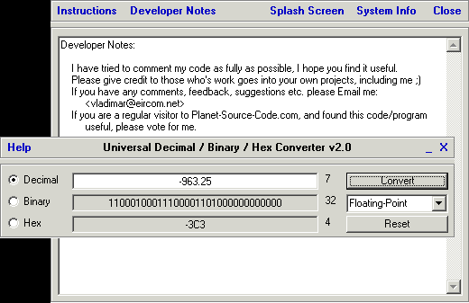



## A Universal Decimal/Binary/Hex Converter v2\.0

### Description

This code will convert any decimal, binary or hex number into the other two formats. A good code for those who want to learn how to use functions with multiple and optional parameters, also maths functions and creating a custom GUI. The program handles 8bit, 16bit, fixed-point, floating point and any length binary upto 31 bits. Full instructions given in the help window + extensively commented code. I'd appreciate some votes for this if you think it deserves them.
 
### More Info
 

             |
---                |---
**Submitted On**   |2003-01-09 22:48:18
**By**             |[Vladimar](https://github.com/Planet-Source-Code/PSCIndex/blob/master/ByAuthor/vladimar.md)
**Level**          |Beginner
**User Rating**    |4.8 (57 globes from 12 users)
**Compatibility**  |VB 6\.0
**Category**       |[Math/ Dates](https://github.com/Planet-Source-Code/PSCIndex/blob/master/ByCategory/math-dates__1-37.md)
**World**          |[Visual Basic](https://github.com/Planet-Source-Code/PSCIndex/blob/master/ByWorld/visual-basic.md)
**Archive File**   |[A\_Universa1529271142003\.zip](https://github.com/Planet-Source-Code/vladimar-a-universal-decimal-binary-hex-converter-v2-0__1-42429/archive/master.zip)

